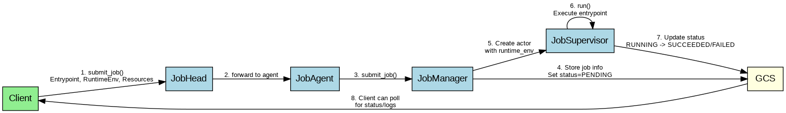

# Ray Job Queue Architecture

Ray's job system is not a traditional queue but rather a distributed job management system that coordinates job submission, execution, and monitoring across a Ray cluster.

## High-Level Architecture


The Ray job management system consists of several key components:

1. **JobSubmissionClient**: Client-side API for submitting and managing jobs
2. **JobHead**: Runs on the head node and handles Ray Jobs APIs
3. **JobAgent**: Handles HTTP requests related to job operations
4. **JobManager**: Coordinates job lifecycle management
5. **JobSupervisor**: Manages the execution of jobs
6. **JobInfoStorageClient**: Persists job data in the Global Control Store (GCS)

## Job Submission Flow



The job submission process follows these steps:

1. Client submits a job using `JobSubmissionClient.submit_job()`
2. JobHead receives the request and forwards it to a JobAgent
3. JobAgent calls JobManager to handle the request
4. JobManager creates a JobSupervisor actor to execute the job
5. JobSupervisor runs the job and updates its status through JobInfoStorageClient
6. Client can query job status and logs at any time

## Job Lifecycle


Jobs in Ray go through several states during their lifecycle:
   
- **PENDING**: Initial state when a job is submitted but not yet running
- **RUNNING**: Job is currently executing
- **SUCCEEDED**: Job completed successfully
- **FAILED**: Job failed during execution
- **STOPPED**: Job was manually stopped by a user

## Component Relationships and Code Implementation


### Key Component Implementations

#### JobSubmissionClient (sdk.py)
```python
class JobSubmissionClient:
    def submit_job(self, *, entrypoint: str, runtime_env: Optional[Dict[str, Any]] = None,
                   metadata: Optional[Dict[str, str]] = None) -> str:
        """Submit and execute a job asynchronously."""
        req = JobSubmitRequest(entrypoint=entrypoint, runtime_env=runtime_env, metadata=metadata)
        r = self._do_request("POST", "/api/jobs/", json_data=json_data)
        return JobSubmitResponse(**r.json()).submission_id
```

#### JobManager (job_manager.py)
```python
class JobManager:
    async def submit_job(self, *, entrypoint: str, submission_id: Optional[str] = None,
                        runtime_env: Optional[Dict[str, Any]] = None,
                        metadata: Optional[Dict[str, str]] = None,
                        entrypoint_num_cpus: Optional[Union[int, float]] = None,
                        entrypoint_num_gpus: Optional[Union[int, float]] = None,
                        entrypoint_memory: Optional[int] = None,
                        entrypoint_resources: Optional[Dict[str, float]] = None) -> str:
        # Generate ID if not provided
        if submission_id is None:
            submission_id = generate_job_id()
        
        # Create JobInfo object
        job_info = JobInfo(entrypoint=entrypoint, status=JobStatus.PENDING,
                         start_time=int(time.time() * 1000), metadata=metadata,
                         runtime_env=runtime_env)
        
        # Store job info
        await self._job_info_client.put_info(submission_id, job_info, overwrite=False)
        
        # Create supervisor actor
        supervisor = self._supervisor_actor_cls.options(
            lifetime="detached",
            name=JOB_ACTOR_NAME_TEMPLATE.format(job_id=submission_id),
            runtime_env=self._get_supervisor_runtime_env(runtime_env, submission_id)
        ).remote(submission_id, entrypoint, metadata or {})
        
        # Run the job
        supervisor.run.remote()
        
        # Monitor job in background
        run_background_task(self._monitor_job(submission_id, job_supervisor=supervisor))
        
        return submission_id
```

#### JobSupervisor (job_supervisor.py)
```python
class JobSupervisor:
    async def run(self):
        # Update job status to RUNNING
        await self._job_info_client.put_status(self._job_id, JobStatus.RUNNING)
        
        try:
            # Execute the entrypoint command in a subprocess
            child_process = self._exec_entrypoint(os.environ.copy(), log_path)
            
            # Wait for command to complete
            return_code = await self._polling(child_process)
            
            # Update final status based on return code
            if return_code == 0:
                await self._job_info_client.put_status(self._job_id, JobStatus.SUCCEEDED)
            else:
                await self._job_info_client.put_status(self._job_id, JobStatus.FAILED)
        except Exception:
            # Handle errors
            await self._job_info_client.put_status(self._job_id, JobStatus.FAILED)
```

#### JobInfo (common.py)
```python
@dataclass
class JobInfo:
    # The status of the job
    status: JobStatus
    # The entrypoint command for this job
    entrypoint: str
    # A message describing the status in more detail
    message: Optional[str] = None
    # The time when the job was started (Unix timestamp in ms)
    start_time: Optional[int] = None
    # The time when the job moved to a terminal state (Unix timestamp in ms)
    end_time: Optional[int] = None
    # Arbitrary user-provided metadata for the job
    metadata: Optional[Dict[str, str]] = None
    # The runtime environment for the job
    runtime_env: Optional[Dict[str, Any]] = None
```
