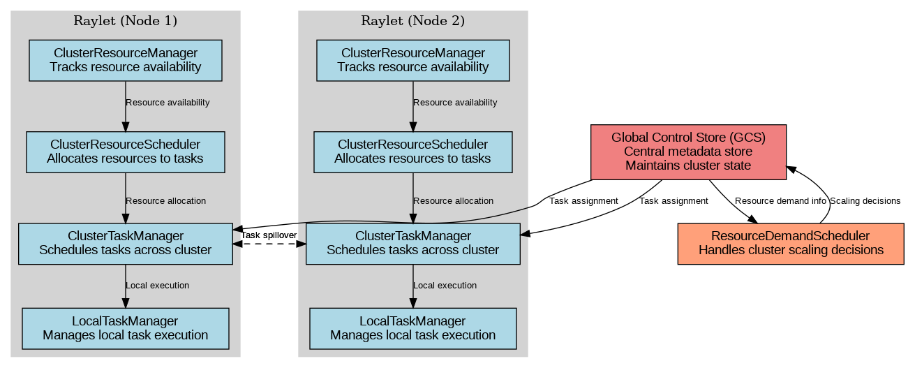
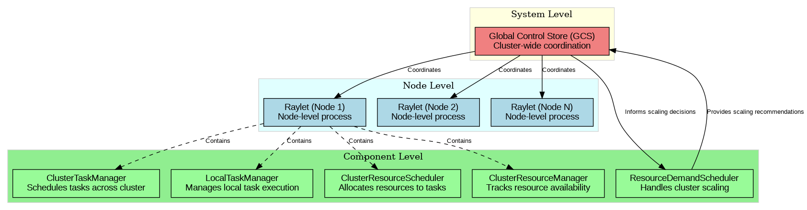
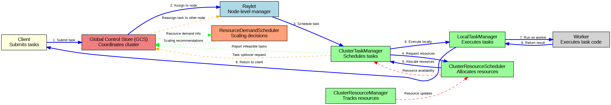
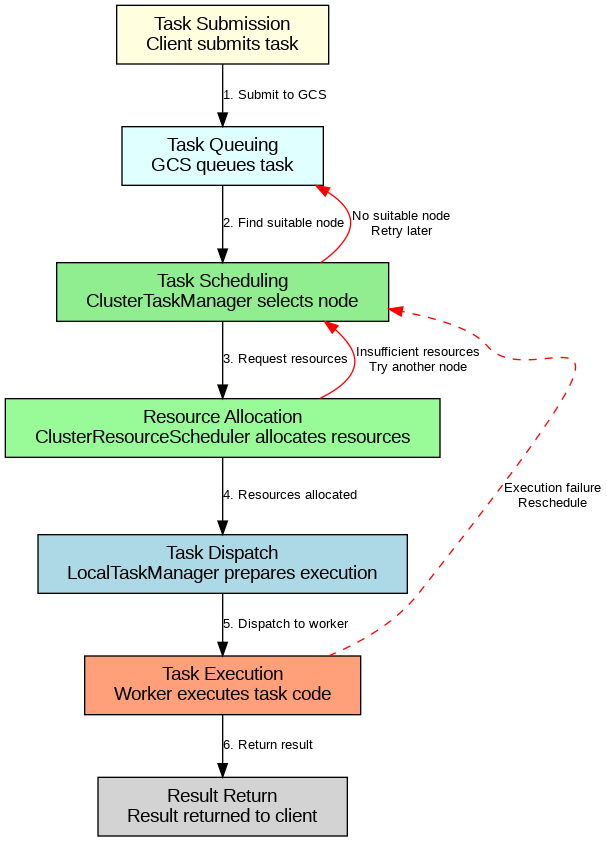

Ray Scheduler Architecture
==========================

This section provides diagrams and explanations of Ray's scheduler architecture.

The Ray scheduler consists of several key components that work together to efficiently distribute tasks across a cluster:

* **Global Control Store (GCS)**: Central metadata store and coordinator
* **Raylet**: Node-level process running on each machine
* **ClusterTaskManager**: Schedules tasks across the cluster
* **LocalTaskManager**: Manages task execution on a single node
* **ClusterResourceScheduler**: Allocates resources to tasks
* **ClusterResourceManager**: Tracks resource availability
* **ResourceDemandScheduler**: Handles cluster scaling decisions

Hierarchical Relationships
-------------------------

Data Flow
---------

Task Lifecycle
-------------

Component Details
----------------

.. include:: components.md
